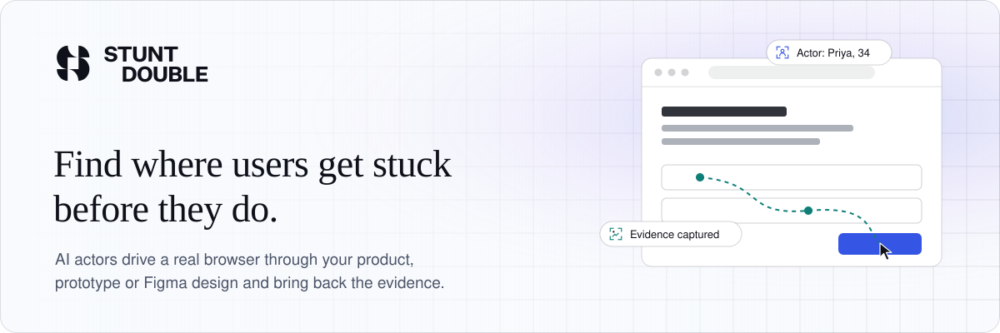
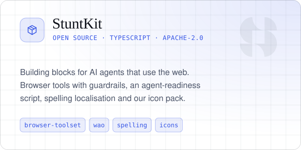
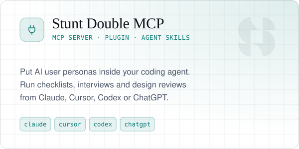

<a href="https://stuntdouble.io?ref=github">
  <picture>
    <source media="(prefers-color-scheme: dark)" srcset="./assets/banner-dark.svg">
    <source media="(prefers-color-scheme: light)" srcset="./assets/banner-light.svg">
    
  </picture>
</a>

<p align="center">
  <a href="https://index.stuntdouble.io/d/stuntdouble.io?ref=badge"></a>
</p>

<p align="center">
  <a href="https://stuntdouble.io?ref=github"><b>Website</b></a> ·
  <a href="https://stuntdouble.io/support/docs"><b>Docs</b></a> ·
  <a href="https://index.stuntdouble.io"><b>Stunt Double Index</b></a> ·
  <a href="https://stuntdouble.io/changelog"><b>Changelog</b></a> ·
  <a href="https://stuntdouble.io/blog"><b>Blog</b></a>
</p>

## Hello, we're Stunt Double

Stunt Double deploys AI users, called **actors**, that drive real browsers through real products. Point them at production, a staging or preview deployment, a prototype or a Figma design and they come back in minutes with recordings, screenshots and the exact step where they got stuck.

Teams use it to:

- **Verify changes** on every pull request and preview deployment, before real users see them
- **Run user interviews** with persona panels when there is no time to recruit
- **Enforce standards** such as brand, tone of voice, design system, accessibility and compliance
- **Measure agent readiness** with the [Stunt Double Index](https://index.stuntdouble.io), which scores how well AI agents can find, understand and act on a website

## Open source

We build Stunt Double in the open where we can. These repositories are the parts you can use today, with or without a Stunt Double account.

<p align="center">
  <a href="https://github.com/stunt-double/stuntkit">
    <picture>
      <source media="(prefers-color-scheme: dark)" srcset="./assets/stuntkit-dark.svg">
      <source media="(prefers-color-scheme: light)" srcset="./assets/stuntkit-light.svg">
      
    </picture>
  </a>
  <a href="https://github.com/stunt-double/stuntdouble-mcp">
    <picture>
      <source media="(prefers-color-scheme: dark)" srcset="./assets/mcp-dark.svg">
      <source media="(prefers-color-scheme: light)" srcset="./assets/mcp-light.svg">
      
    </picture>
  </a>
</p>

### [StuntKit](https://github.com/stunt-double/stuntkit)

TypeScript building blocks for AI agents that use the web, extracted from the Stunt Double product. Apache-2.0.

| Package | What it does |
| --- | --- |
| [`@stunt-double/browser-toolset`](https://github.com/stunt-double/stuntkit/tree/main/packages/browser-toolset) | Browser tools for AI agents over a provider-neutral `BrowserDriver`, with opt-in guards that refuse payments, sign-ups and secrets |
| [`@stunt-double/wao`](https://github.com/stunt-double/stuntkit/tree/main/packages/wao) | Web Agent Optimiser: a drop-in script that repairs the accessibility tree agents read, so legacy sites work for agents |
| [`@stunt-double/spelling`](https://github.com/stunt-double/stuntkit/tree/main/packages/spelling) | Whole-word American, British and Canadian spelling localisation |
| [`@stunt-double/icons`](https://github.com/stunt-double/stuntkit/tree/main/packages/icons) | The Continuity icon pack: 235 icons as geometry, SVG files and React components |

Each package ships an Agent Skill, so your coding agent knows when to reach for it:

```sh
/plugin marketplace add stunt-double/stuntkit
/plugin install stuntkit@stuntkit
```

### [Stunt Double MCP](https://github.com/stunt-double/stuntdouble-mcp)

Plugin, skills and agents for the hosted Stunt Double MCP server. Create actors, run checklists and interviews, review designs and verify pull requests without leaving Claude, Cursor, Codex or ChatGPT.

```sh
# Claude Code
claude mcp add --transport http stuntdouble https://app.stuntdouble.io/api/mcp

# Or install the plugin with skills and agents included
claude plugin marketplace add stunt-double/stuntdouble-mcp
claude plugin install stuntdouble@stuntdouble

# Skills for any agent that reads SKILL.md
npx skills add stunt-double/stuntdouble-mcp
```

For Claude on the web, desktop or mobile, add `https://app.stuntdouble.io/api/mcp` under **Settings → Connectors → Add custom connector**.

## Useful resources

| | |
| --- | --- |
| **Try it** | [Run a demo](https://app.stuntdouble.io/demo?ref=github) · [Sign in](https://app.stuntdouble.io/login?ref=github) · [Pricing](https://stuntdouble.io/pricing) |
| **Learn** | [Docs](https://stuntdouble.io/support/docs) · [Guides](https://stuntdouble.io/guides) · [Use cases](https://stuntdouble.io/use-cases) · [Glossary](https://stuntdouble.io/glossary) |
| **Build** | [Integrations](https://stuntdouble.io/integrations) · [MCP server](https://github.com/stunt-double/stuntdouble-mcp) · [StuntKit](https://github.com/stunt-double/stuntkit) · [llms.txt](https://stuntdouble.io/llms.txt) |
| **Agent readiness** | [Stunt Double Index](https://index.stuntdouble.io) · [Our own score](https://index.stuntdouble.io/d/stuntdouble.io?ref=badge) |
| **Stay current** | [Changelog](https://stuntdouble.io/changelog) · [Blog](https://stuntdouble.io/blog) · [Status](https://status.stuntdouble.io) |
| **Trust** | [Security](https://stuntdouble.io/security) · [Privacy](https://stuntdouble.io/privacy) · [Brand](https://stuntdouble.io/brand) |

## Contributing

Issues and pull requests are welcome on our public repositories. Each one has a `CONTRIBUTING.md` with the dev loop, and a `SECURITY.md` for reporting vulnerabilities privately. For anything else, [get in touch](https://stuntdouble.io/contact) or find us on [LinkedIn](https://www.linkedin.com/company/stunt-double/).
